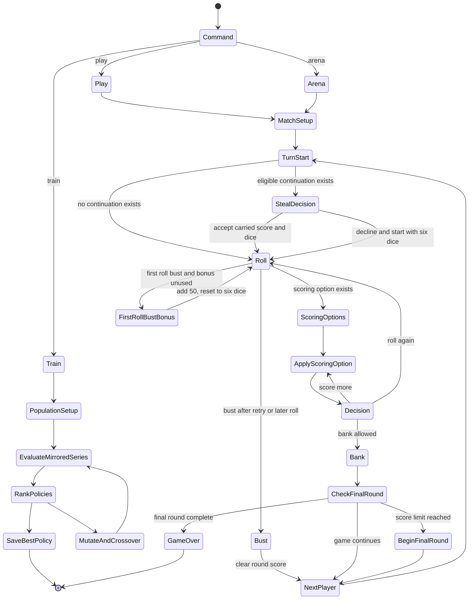
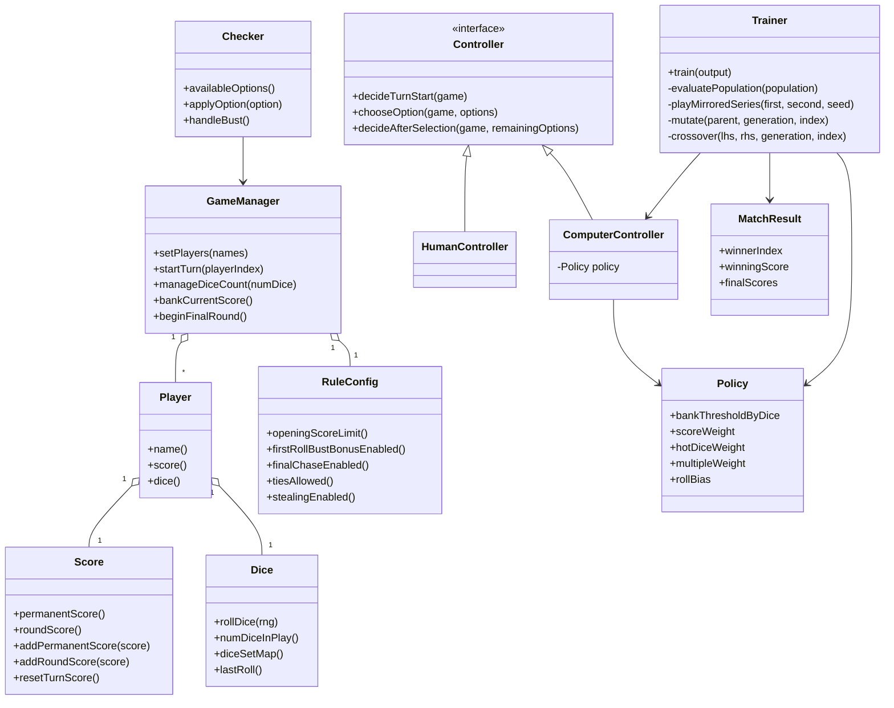

# Computers vs Zilch

This project is the headless, AI-focused Zilch implementation. It follows the same canonical gameplay profile as `../Zilch` and Java `Zilch Basic`, without the SFML/OpenGL or LibGDX UI layers.

It supports three workflows on top of one rules engine and one shared rule configuration:

1. `play`: a terminal game where a human plays against a computer policy.
2. `train`: long-running multithreaded self-play that evolves the computer policy and writes the best result to disk.
3. `arena`: a headless policy-vs-policy evaluator that runs mirrored seat-order matchups.

## Runtime State Machine



## Class Interconnections



## Build

```bash
cmake -S . -B build
cmake --build build
```

Or:

```bash
make
```

## Test

```bash
ctest --test-dir build --output-on-failure
make test
```

The `zilch_tests` target in `tests/regression_tests.cpp` covers rule scoring, hot-dice resets, Stealing lifecycle, player/final-round state resets, bust/bank behavior, policy parser validation, CLI validation, and mirrored arena behavior.

## Shared Gameplay Profile

`play`, `arena`, and `train` use the same `RuleConfig`. Their canonical defaults are:

| Setting | Default |
| --- | --- |
| Winning score | 5000 |
| Opening score | 1000 |
| Straight | On |
| Three Pairs | On |
| Multiples and extensions | On |
| Singles | On |
| First-Roll Bust, fixed 50-point retry | On |
| Final Chase | On |
| Allow Ties | On |
| Stealing | Off |

The opening score is the amount a player must reach before banking freely. The legacy engine API calls this the bank threshold; both names refer to the same setting.

Every mode accepts the same rule flags:

```bash
--score-limit N
--opening-score N
--straight BOOL
--three-pairs BOOL
--multiples BOOL
--singles BOOL
--first-roll-bust BOOL
--final-chase BOOL
--allow-ties BOOL
--stealing BOOL
```

Boolean values accept `on`/`off`, `true`/`false`, `yes`/`no`, `enabled`/`disabled`, and `1`/`0`. The opening score cannot exceed the winning score, and at least one scoring rule must remain enabled.

## Play Against The Computer

```bash
./build/zilch play
./build/zilch play --name Jacob --score-limit 7000
./build/zilch play --difficulty easy
./build/zilch play --difficulty medium
./build/zilch play --difficulty hard --stealing on
./build/zilch play --policy trained_policy.cfg
./build/zilch play --opening-score 750 --stealing on
```

The named levels are intended for human play. Easy takes every available scoring option and normally banks at 600 points. Medium adds score-aware finish, buffer, and staging choices. Hard combines those choices with the strongest tracked policy for the selected standard or Stealing rules.

`--difficulty` and `--policy` are mutually exclusive. With neither option, `play` preserves its legacy behavior: it loads `trained_policy.cfg` from the project root when present and otherwise uses the built-in baseline. An explicit policy path runs the policy directly without named-level endgame heuristics, which keeps research comparisons reproducible.
During option selection, enter `all` or `a` to apply the highest-scoring remaining options until no more scoring choices are available. Enter `?` to reprint the current options.

## Train By Self-Play

```bash
./build/zilch train
./build/zilch train --generations 100 --population 32 --matches 400 --threads 8
./build/zilch train --resume trained_policy.cfg --output trained_policy.cfg
./build/zilch train --stealing on --opening-score 750
```

Training evaluates policies in parallel across matches, ranks them by self-play performance, mutates the best performers, and persists the current best policy to `trained_policy.cfg`.
`--matches` counts individual games, must be even, and must be at least twice the population because each matchup is evaluated as a same-seed mirrored pair.

## Compare Policies

```bash
./build/zilch arena --bot-a hard --bot-b medium --games 400
./build/zilch arena --bot-a hard --bot-b medium --stealing on --games 400
./build/zilch arena --policy-a trained_policy.cfg --policy-b other_policy.cfg --games 400
./build/zilch arena --stealing on --opening-score 750 --games 400
```

`arena` runs same-seed mirrored seat order, so each policy gets the same number of first-player and second-player games against paired dice streams.
Use `--bot-a` and `--bot-b` to select named levels, or `--policy-a` and `--policy-b` to compare exact policy files. A named selector and explicit policy path are mutually exclusive for the same seat. `--games` must be even; invalid difficulty names and policy files fail instead of silently falling back to baseline.

See [STRATEGY.md](STRATEGY.md) for the exact named-level behavior, tracked policy provenance, deterministic validation commands, and research limitations.

## Notes

- `--seed` can be used with `play`, `train`, and `arena` for reproducible runs.
- Score limits below 1000 are rejected to match the game rules.
- First-roll busts use the house rule implemented in `Checker::handleBust()`: the player receives 50 round points, the dice reset to six, and the same turn retries once. A second bust ends the turn and clears the round score.
- Stealing is optional and disabled by default. When a player banks with one to five dice remaining, the immediately following player may carry that round score and saved-multiple state into a roll of those dice. The recipient must already have the configured opening score banked. Declining, busting, scoring all remaining dice, or disabling the rule ends the chain. A bust on an accepted continuation does not receive the first-roll bonus. A successfully banked continuation may be offered again.
- If ties are disabled, a final-round tie leaves the incumbent leader, the first player to attain that final high score, as the winner.
- `play`, `train`, and `arena` share the same rules engine, so gameplay, evaluation, and self-play stay aligned.
- The intentional differences are AI-specific: `play` is human versus computer, `train` evolves policies, and `arena` compares policies through mirrored headless matches. Visual rendering, animation settings, and GUI assets remain exclusive to the visual projects.
- The trainer is optimizing a parameterized strategy, not solving the full game exhaustively.
