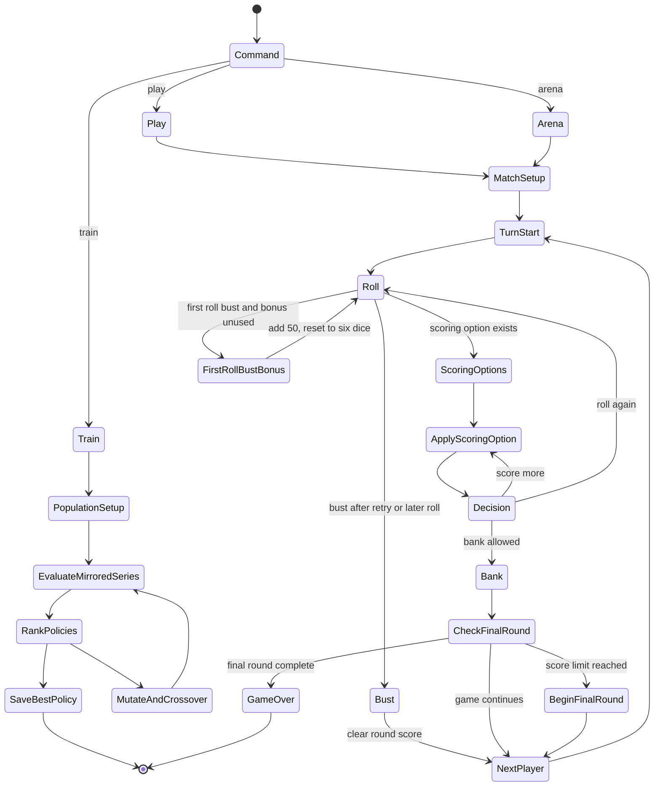
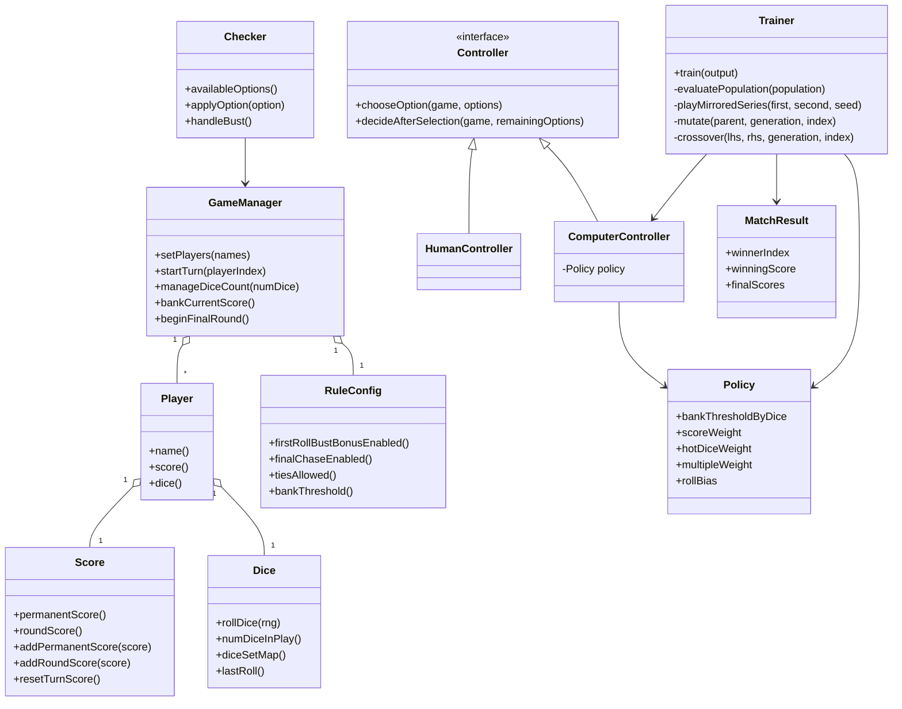

# Computers vs Zilch

This project is now a headless derivative of the shared game engine used in `../Zilch`, without the SFML/OpenGL UI layer.

It supports two workflows on top of the same rules engine:

1. `play`: a terminal game where a human plays against a computer policy.
2. `train`: long-running multithreaded self-play that evolves the computer policy and writes the best result to disk.
3. `arena`: a headless policy-vs-policy evaluator that runs mirrored seat-order matchups.

## Runtime State Machine



## Class Interconnections



## Build

```bash
cmake -S . -B build
cmake --build build
```

Or:

```bash
make
```

## Test

```bash
ctest --test-dir build --output-on-failure
make test
```

The `zilch_tests` target in `tests/regression_tests.cpp` covers rule scoring, hot-dice resets, player/final-round state resets, bust/bank behavior, policy parser validation, CLI validation, and mirrored arena behavior.

## Play Against The Computer

```bash
./build/zilch play
./build/zilch play --name Jacob --score-limit 7000
./build/zilch play --policy trained_policy.cfg
```

If `trained_policy.cfg` exists in the project root, `play` uses it automatically.
During option selection, enter `all` or `a` to apply the highest-scoring remaining options until no more scoring choices are available. Enter `?` to reprint the current options.

## Train By Self-Play

```bash
./build/zilch train
./build/zilch train --generations 100 --population 32 --matches 400 --threads 8
./build/zilch train --resume trained_policy.cfg --output trained_policy.cfg
```

Training evaluates policies in parallel across matches, ranks them by self-play performance, mutates the best performers, and persists the current best policy to `trained_policy.cfg`.
`--matches` counts individual games, must be even, and must be at least twice the population because each matchup is evaluated as a same-seed mirrored pair.

## Compare Policies

```bash
./build/zilch arena --policy-a trained_policy.cfg --policy-b other_policy.cfg --games 400
```

`arena` runs same-seed mirrored seat order, so each policy gets the same number of first-player and second-player games against paired dice streams.
`--games` must be even; invalid policy files fail instead of silently falling back to baseline.

## Notes

- `--seed` can be used with both `play` and `train` for reproducible runs.
- Score limits below 1000 are rejected to match the game rules.
- First-roll busts use the house rule implemented in `Checker::handleBust()`: the player receives 50 round points, the dice reset to six, and the same turn retries once. A second bust ends the turn and clears the round score.
- `play`, `train`, and `arena` share the same rules engine, so gameplay, evaluation, and self-play stay aligned.
- The relevant non-GUI pieces from `../Zilch`/`zilch-cli` are retained here: dice scoring rules, final-chase behavior, configurable rule toggles, bank-threshold controls, and terminal input closure handling. The SFML/OpenGL UI layer, renderer assets, and GUI state machine are intentionally excluded.
- The trainer is optimizing a parameterized strategy, not solving the full game exhaustively.
